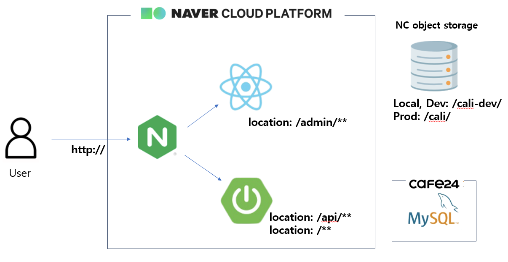

## 🚀 기술 스택

### 🔧 Backend (Spring Boot)
- Spring Boot 3.5.7
- Spring Security
- Thymeleaf
- JPA / MyBatis / QueryDSL
- MySQL 8.0
- Gradle
- Lombok

### 🎨 Frontend (React Admin)
- React 19.2
- React Router 19.2
- Toast UI Grid
- BootStrap
- npm / Vite

### ☁ Infra / DevOps
- Nginx
- GitHub Actions (CI/CD)
- Naver Object Storage
- Naver Cloud Platform Server (micro) - 개발서버(cali-dev)

---

## 📌 주요 기능

### ✨ 사용자(Thymeleaf 기반)
- 회원가입 및 로그인
- 접수 등록 & 결제
- 업체관리 등 기본정보 관리
- 서비스 관련 UI 렌더링

### 🔐 관리자(React 기반 Admin)
- 작업 이력 관리
- 로그인 이력 관리
- 부서/ 직급/ 직무 관리
- 계정관리
- 업데이트 사항 관리
- 대시보드 / 모니터링(통계)

---

## 📚 시스템 아키텍처

### 개발서버(cali-dev)
  
- 서버 내 모든 API 처리는 Spring에서 처리
- 어드민 관련 페이지(/admin/**)들의 경우 리액트 기반으로 화면 렌더링
- 첨부파일 및 기타 정적 리소스들에 대해선 NCP Object Storage 사용
    > 로컬, 개발서버의 경우 버킷 내 'cali-dev' 하위 경로 사용
    > 운영서버의 경우 버킷 내 'cali' 하위 경로 사용
- DB 서버의 경우, cafe24를 통해 대여받은 가상호스트 사용
    > 로컬, 개발서버의 경우 동일한 DB 공유
    > 운영서버의 경우 별도 DB 사용할 예정이며, 25. 12. 19 기준 미정

---
