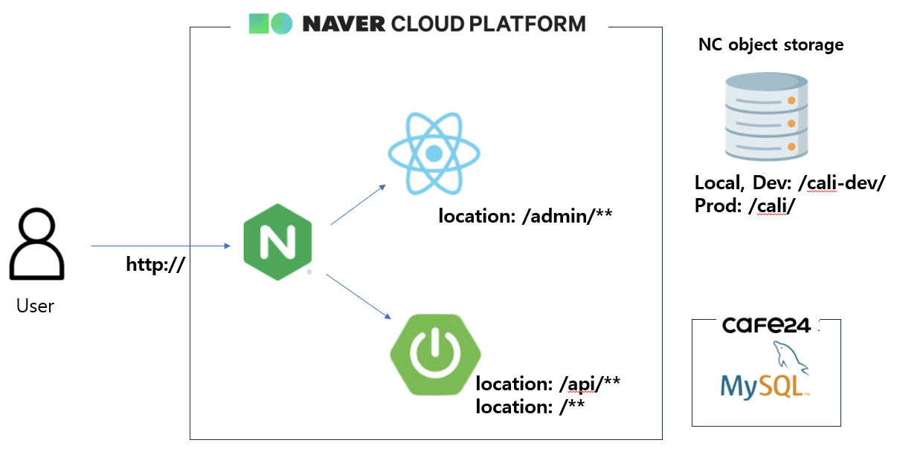

# CALI — 교정관리 시스템

계측기기 교정 전문 업체를 위한 업무 관리 시스템.
교정 접수부터 성적서 작성, 결재, 파일 발행까지의 흐름을 처리하는 하이브리드 웹 애플리케이션입니다.

---

## 기술 스택

### Backend

| 항목 | 버전 / 내용 |
|---|---|
| Spring Boot | 3.5.7 |
| Spring Security | 6.x |
| Spring Data JPA + QueryDSL | ORM 주력 |
| Thymeleaf | SSR 템플릿 엔진 |
| MapStruct | 1.6.3 |
| Apache POI | 5.3.0 (엑셀 처리) |
| Springdoc OpenAPI | 2.8.3 (Swagger UI) |
| MySQL | 8.x |
| Gradle | 빌드 도구 |
| Lombok | 코드 간결화 |

### Frontend (Admin)

| 항목 | 버전 / 내용 |
|---|---|
| React | 18.3.1 |
| React Router | 7.x |
| Vite | 7.x (빌드 도구) |
| Toast UI Grid | 4.21.x |
| sweetalert2 | 11.x |
| react-toastify | 11.x |

### Infra / DevOps

| 항목 | 내용 |
|---|---|
| Nginx | 리버스 프록시 |
| GitHub Actions | CI/CD 자동 배포 |
| Naver Cloud Platform | 개발 서버 (micro) |
| Naver Object Storage | 첨부파일 스토리지 (S3 호환) |
| cafe24 | DB 가상호스트 |

---

## 시스템 아키텍처

### 개발서버 (cali-dev)

- 모든 API 처리는 Spring Boot(포트 8050)에서 담당
- `/admin/**` 경로는 Vite 빌드 결과물(React SPA)로 화면을 렌더링하며, 나머지 경로는 Thymeleaf SSR로 처리
- 첨부파일 및 이미지 리소스는 NCP Object Storage에 저장
  - 로컬 및 개발서버: 버킷 내 `cali-dev/` 하위 경로 사용
  - 운영서버: 버킷 내 `cali/` 하위 경로 사용
- DB는 cafe24를 통해 대여받은 가상호스트를 사용
  - 로컬 및 개발서버는 동일 DB를 공유
  - 운영서버 DB는 별도 운용 예정
- 성적서 작성은 별도 작업 서버(cali-worker)와 HTTP 콜백 구조로 연동되며, `app.worker.url`을 비워두면 데모 모드로 동작

---

## 주요 기능

### 사용자 / 업무 화면 (Thymeleaf SSR 기반)

| 기능 | 설명 |
|---|---|
| 회원가입 / 로그인 | 사업자번호 기반 계정, Remember-Me(30일) 지원 |
| 교정 신청(접수) 관리 | 접수 등록 및 조회, 교정신청서 PDF 다운로드, 채번 시퀀스 자동 발급 |
| 성적서 관리 | 성적서 등록 / 수정 / 삭제, 다중 선택 통합수정 |
| 성적서 작성 | cali-worker 연동 Excel 자동생성, 폴링 기반 진행 상태 UI |
| 실무자 결재 | 작성 완료 성적서의 원본 / Excel / PDF 다운로드 |
| 업체 / 담당자 관리 | 업체 정보 및 담당자 CRUD |
| 품목 / 분류코드 관리 | 교정 품목, 수수료 이력, 분류코드 계층 관리 |
| 표준장비 관리 | 교정에 사용되는 표준장비 CRUD |
| 기본정보 관리 | 부서, 직급, 직무 등 조직 기반 정보 관리 |

### 관리자 화면 (React Admin SPA 기반)

| 기능 | 설명 |
|---|---|
| 직원 관리 | 직원 목록 / 등록 / 수정 / 소프트삭제, 메뉴별 읽기 권한 관리 |
| 업데이트 공지 관리 | 공지 등록 / 수정 / 삭제 |
| 회사정보 관리 | 회사 기본정보 및 KOLAS · ILAC · 사내 로고 이미지 관리 (ADMIN 전용) |
| 성적서 시트 설정 | 성적서 출력 양식 기본값 설정 |

---

## API 명세

REST API는 HTTP 메서드의 의미(GET 조회 / POST 등록 / PATCH 부분수정 / PUT 전체교체 / DELETE 삭제)를 기준으로 설계되었으며, URI는 리소스 계층 구조로 구성됩니다. 응답 상태코드는 200 / 201 / 400 / 403 / 404 / 500을 상황에 맞게 반환합니다.

Swagger UI 접근: `http://{host}/swagger-ui/index.html`

| 태그 | 기본 경로 | 주요 역할 |
|---|---|---|
| 회원 | `/api/member` | 로그인, 회원가입, 직원 CRUD, 메뉴 권한 |
| 교정신청 | `/api/caliOrder` | 접수 등록 / 조회 / 신청서 다운로드 |
| 성적서 | `/api/report` | 성적서 CRUD, 필수항목 검증, 통합수정 |
| 성적서 작업 | `/api/report/jobs` | 배치 생성 및 상태 폴링 |
| 기본정보 | `/api/basic` | 업체 / 분류코드 / 부서 / 옵션 조회 |
| 샘플 | `/api/sample` | 샘플(기기) 등록 / 수정 / 파일 관리 |
| 표준장비 | `/api/equipment` | 표준장비 CRUD |
| 품목 | `/api/item` | 품목 CRUD, 수수료 이력 |
| 파일 | `/api/file` | 파일 다운로드 / 삭제 |
| 회사정보 | `/api/admin/env` | 환경설정, 이미지 업로드 (ADMIN 전용) |
| 작업서버 콜백 | `/api/worker` | cali-worker 내부 통신 전용 |

**권한 규칙 (SecurityConfig 기준)**

| 조건 | 권한 |
|---|---|
| `DELETE /api/**` | ROLE_ADMIN 필수 |
| `POST · PATCH · PUT /api/admin/**` | ROLE_ADMIN 필수 |
| `GET` 전체 | 인증된 사용자 허용 |

---

## 구현 예정 기능

| 기능 | 설명 |
|---|---|
| 출장 일정 관리 | 교정 담당자의 현장 출장 스케줄 등록 및 조회 |
| 작업 이력 관리 | 교정 처리 단계별 이력 추적 및 현황 대시보드 |
| 견적서 발행 | 업체 대상 교정 견적서 생성 및 발송 |
| 완료통보서 발행 | 교정 완료 후 공식 통보서 자동 생성 |
| 모니터링 대시보드 | 진행 현황 통계, 로그인 이력 등 어드민 전용 |

---

## 주요 이슈 & 해결

### 이슈 1 — SSR 컨트롤러와 REST API 컨트롤러 빈 이름 충돌

**상황**: `controller/MemberController`와 `api/MemberController`처럼 같은 클래스명이 서로 다른 패키지에 존재할 경우, Spring이 동일한 빈 이름으로 등록을 시도하여 기동 시 오류가 발생합니다.

**해결**: `api/` 하위 컨트롤러 전체에 `@RestController("ApiXxxController")` 형식으로 빈 이름을 명시하는 컨벤션을 도입하여 충돌을 방지했습니다.

---

### 이슈 2 — Multipart 파싱 단계 예외가 `@RestControllerAdvice`에서 미처리

**상황**: 파일 업로드 시 설정된 크기 제한을 초과하면 `MaxUploadSizeExceededException`이 컨트롤러 진입 전 DispatcherServlet 단계에서 발생하여, `@RestControllerAdvice` 기반의 전역 예외 핸들러가 이를 잡지 못합니다.

**해결**: `GlobalApiExceptionHandler`에 `MaxUploadSizeExceededException` 핸들러를 별도 추가하고, 응답 형식을 기존 `ResMessage` 구조로 통일했습니다.

---

### 이슈 3 — React Admin 이미지 업로드 시 Multipart boundary 누락

**상황**: 공통 fetch 함수(`adminFetch`)가 `Content-Type: application/json`을 기본 헤더로 설정하므로, 이미지 업로드(multipart/form-data) 요청에 그대로 사용하면 boundary 값이 포함되지 않아 서버에서 파싱이 실패합니다.

**해결**: 파일 업로드 엔드포인트에서는 `adminFetch` 대신 `fetch`를 직접 사용하고 `Content-Type` 헤더를 명시하지 않아, 브라우저가 boundary를 자동으로 포함하도록 처리했습니다.

---

### 이슈 4 — Spring Security 세션 만료 시 React Admin에 HTML 응답 반환

**상황**: Security 기본 동작은 미인증 요청을 로그인 페이지로 리다이렉트하므로, React SPA에서 API를 호출하면 JSON이 아닌 HTML 페이지가 응답으로 수신됩니다.

**해결**: `SecurityConfig`에서 `/api/**` 경로 요청에 한해 로그인 리다이렉트 대신 JSON `401` 응답을 반환하는 `AuthenticationEntryPoint`를 별도 설정했습니다.

---

### 이슈 5 — 채번 시퀀스 동시 요청 시 중복 발급 가능성

**상황**: 교정신청서 채번 로직이 SELECT → UPDATE 구조로 구성되어, 동시 요청이 발생하면 같은 번호를 조회하는 레이스 컨디션이 발생할 수 있습니다.

**해결**: `@Transactional` + 비관적 락(`SELECT ... FOR UPDATE`) 적용으로 동시 접근 시 순차 처리를 보장했습니다.

---

### 이슈 6 — 성적서 작성 폴링 중 작업 서버 장애 시 무한 대기

**상황**: cali-worker가 응답하지 않는 경우, 프론트엔드 폴링(3초 주기)이 타임아웃 기준 없이 계속 실행됩니다.

**해결**: 최대 폴링 횟수(100회, 약 5분)를 제한하여 초과 시 에러 처리 및 사용자 안내 메시지로 종료되도록 했습니다. 서버 측 배치 상태는 정상 보존되므로 재접속 후 결과 확인이 가능합니다.

**추후 과제**: 작업 서버 장애 감지 시 자동 재시도 또는 상태 복구 UI 제공.

---

### 이슈 7 — `@Valid` 검증 실패와 `IllegalArgumentException`의 응답 코드 혼동

**상황**: `@Valid` 실패는 `MethodArgumentNotValidException`으로 400을 반환하지만, 서비스 로직 내부의 `IllegalArgumentException`은 전용 핸들러가 없어 500으로 처리됩니다. Swagger `@ApiResponses` 작성 시 400으로 잘못 명시할 위험이 있었습니다.

**해결**: `GlobalApiExceptionHandler` 분석 결과를 바탕으로, 각 예외 유형별 실제 응답 코드 매핑 기준을 작업 규칙 문서에 명시하여 Swagger 문서와 실제 동작이 일치하도록 관리 기준을 수립했습니다.

---

### 이슈 8 — 서버 사이드 PDF 변환 품질 한계 (cali-worker 전략 변경)

**상황**: 성적서 작성 과정에서 서버 사이드 PDF 변환 라이브러리의 출력 품질이 실무 사용 기준에 미달함을 확인했습니다.

**대응**: 서버 사이드 PDF 생성 방식을 중단하고, Excel COM Automation 기반의 클라이언트 미들웨어(C# WPF)로 전환할 예정입니다. 현장 조사(계측/교정 업체 프로세스 파악) 후 설계를 진행합니다.
